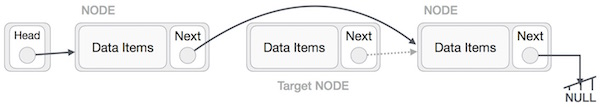

# List

## What is a linked list?

A linked list is a sequence of data structures, which are connected together via links.

Linked List is a sequence of links which contains items. Each link contains a connection to another link. Linked list is the second most-used data structure after array.

### Represenation of linked list:

## Basic operations on lists

 | Operation | Time Complexity |
 |  -------  | -----------|
 | Access| O(n) |
 | Search| O(n) |
 | Insertion| O(1) |
 | Deletion| O(1) |

### Insertion:

##### Step 1:

##### Step 2:

##### Step 3:

##### Step 4:

### Deletion:

##### Step 2:

##### Step 3:

##### Step 4:

